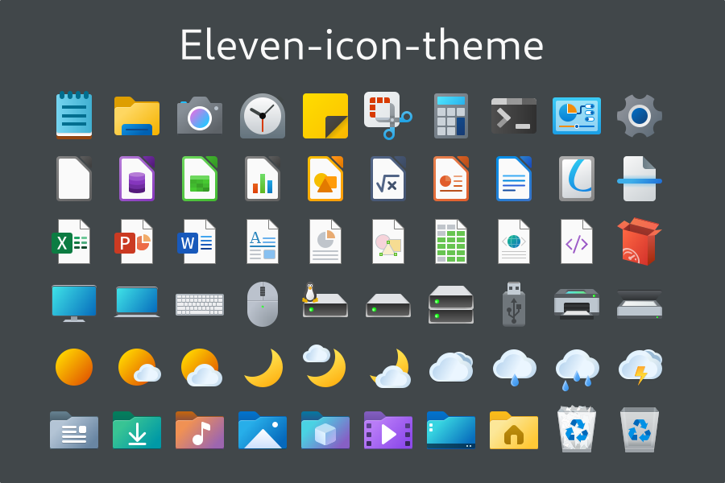
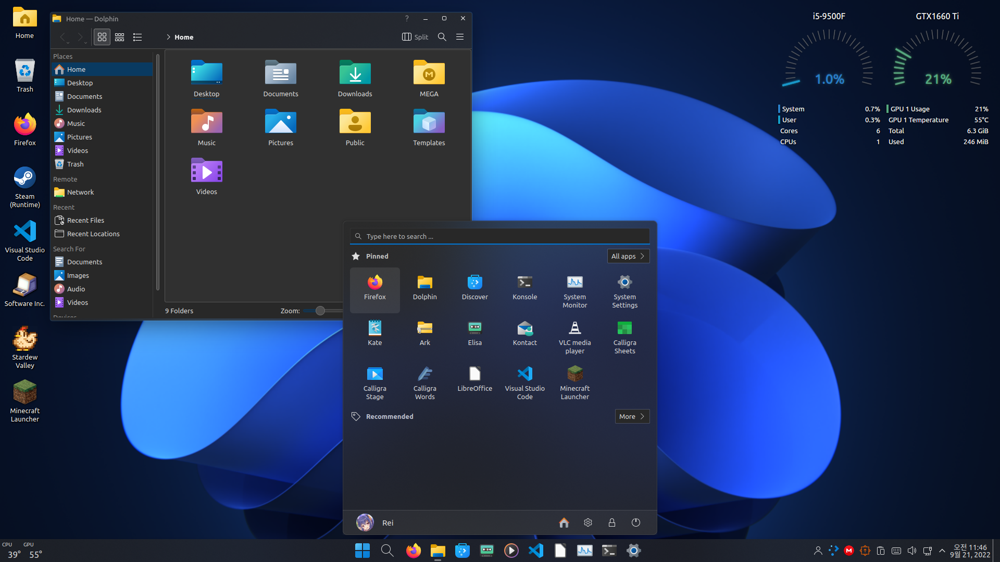

# Eleven-icon-theme

Windows 11 Style icon theme, Successed of Cobalt-icons

## Features

* Following Windows 11 Design, but remixed for Linux.

## Sources

* Segoe Fluent
* Fluent-icon-theme
* Cobalt-icons

## Installation

* Using script(local only)

## Preview

## Screenshots

* KDE

* Xfce
